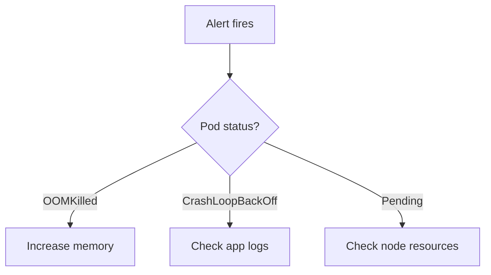

# Runbook Writer

Writing guidance for infrastructure runbooks — operational procedures executed under time pressure during incidents or maintenance windows. Runbooks are distinct from how-to guides: they optimize for speed under stress, include decision trees and escalation paths, and must contain exact commands, not pseudocode.

For shared writing principles (quantification, concrete specificity, structured analysis), load the `writing-foundations` skill.

---

## Runbook Type Classification

Before writing, determine which type of runbook you're creating:

| Type | When to Use | Structure |
|---|---|---|
| **Alert Runbook** | Maps to a specific Prometheus/Grafana alert | 4-section: Meaning / Impact / Diagnosis / Mitigation |
| **Procedure Runbook** | Operational task (secret rotation, failover, scaling) | Numbered steps with prerequisites, verification, rollback |
| **System Runbook** | Service-level operational manual | Multi-section covering monitoring, deployment, troubleshooting, DR |

---

## Alert Runbook Template

The CNCF community standard, used by [prometheus-operator/runbooks](https://runbooks.prometheus-operator.dev) across 100+ Kubernetes alerts. The alert name becomes the heading — this enables `runbook_url` auto-generation ([kubernetes-mixin convention](https://github.com/kubernetes-monitoring/kubernetes-mixin/blob/master/runbook.md)).

```markdown
### AlertName

## Meaning

[What state the system is in when this alert fires. One paragraph.]

## Impact

- [User-visible or service-level effect]
- [Distinguish degradation vs. full unavailability]

## Diagnosis

1. Check [fast/cheap thing first]:
   ```bash
   kubectl -n $NAMESPACE get pod $POD
   ```

2. Check [slower/more detailed thing]:
   ```bash
   kubectl -n $NAMESPACE describe pod $POD
   ```

3. Check [logs for root cause]:
   ```bash
   kubectl -n $NAMESPACE logs $POD -c $CONTAINER --tail=100
   ```

## Mitigation

**Immediate** (stop the bleeding):
1. [Emergency step — e.g., scale up, restart, failover]

**Permanent** (root cause fix):
1. [Fix step with exact commands or links to upstream docs]
```

**Sources**: [prometheus-operator/runbooks KubePodCrashLooping](https://github.com/prometheus-operator/runbooks/blob/main/content/runbooks/kubernetes/KubePodCrashLooping.md), [Grafana Mimir runbooks](https://grafana.com/docs/mimir/latest/manage/mimir-runbooks/)

### Alert Runbook Quality Checklist

| Check | Pass criteria |
|---|---|
| **Title = alert name** | Exact match enables `runbook_url` linking |
| **Meaning is one paragraph** | Reader knows what's happening in 10 seconds |
| **Impact distinguishes severity** | Degradation vs. outage vs. data loss |
| **Diagnosis is ordered cheap→expensive** | Fast checks first, expensive queries last |
| **Every command is exact** | No "check the logs" — give the full `kubectl` command with `$VARIABLE` placeholders |
| **Mitigation separates immediate vs. permanent** | Stop the bleeding first, root cause second ([Grafana incident philosophy](https://grafana.com/blog/2024/03/28/call-me-maybe-designing-an-incident-response-process/)) |
| **Links to dashboards by name** | "Check the `Mimir / Writes Resources` dashboard", not "check Grafana" |
| **Includes PromQL/LogQL where relevant** | Embedded queries the reader can copy-paste |

---

## Procedure Runbook Template

For operational tasks like secret rotation, certificate renewal, failover procedures, or scaling operations. Based on the [developer-docs-framework runbook content type](https://github.com/anivar/developer-docs-framework/blob/main/references/content-types.md) and the [Diataxis how-to guide principles](https://diataxis.fr/how-to-guides/) extended for incident-context reading.

```markdown
# How to [accomplish specific operational goal]

[One sentence: what this achieves and when you'd need it.]

## Prerequisites

- [Access requirement — be specific about role/account]
- [Tool requirement — exact version if it matters]
- [Cluster/environment context]

## Architecture overview

[Brief description of the system being operated on. Include a table mapping logical components to concrete resources (namespaces, SSM paths, app IDs, etc.). Keep it short — the reader needs orientation, not education.]

## Steps

### 1. [Action verb] [what]

[Instruction with exact command]

```bash
exact-command --with-real-flags
```

**Verify**: [How to confirm this step worked]

### 2. [Action verb] [what]

[Instruction]

> **On failure**: [What to do if this step fails — skip to step N, or see Troubleshooting]

### N. Verify end-to-end

[Final verification that the entire procedure succeeded]

## Rollback

[How to undo the procedure if something goes wrong after partial completion]

## Troubleshooting

### [Symptom]

[Diagnosis and fix]
```

### Procedure Runbook Quality Checklist

| Check | Pass criteria |
|---|---|
| **Title starts with "How to"** | Goal is in the title |
| **Prerequisites are concrete** | Specific accounts, roles, tools — not "appropriate access" |
| **Architecture overview is a table** | Maps logical names to concrete resources (namespaces, paths, IDs) |
| **Every step has exact commands** | Copy-pasteable. No pseudocode, no "something like" |
| **Every step has verification** | Reader can confirm it worked before proceeding |
| **Failure paths are explicit** | "On failure: skip to step N" or "see Troubleshooting section" |
| **Rollback section exists** | Even if it's "not applicable — this operation is idempotent" |
| **Links to source-of-truth configs** | Link to terraform, helm values, or git repos — not just prose descriptions |
| **Troubleshooting covers common failures** | At least the failures you've seen or can anticipate |
| **Citations for non-obvious commands** | Link to the docs/repo where the reader can learn more |

---

## System Runbook Template

For service-level operational manuals. Based on the [Skelton-Thatcher run-book template](https://github.com/SkeltonThatcher/run-book-template/blob/master/run-book-template.md), endorsed by [kubernetes-mixin](https://github.com/kubernetes-monitoring/kubernetes-mixin/blob/master/runbook.md) as the system-level complement to alert runbooks.

A system runbook covers the full operational surface of a service. Use this for service onboarding, disaster recovery planning, or when a new team member needs to understand how to operate a system.

Required sections (adapt as needed):

1. **Service overview** — What it does, who owns it, SLAs
2. **Architecture** — Components, data flows, dependencies
3. **Access** — How to get credentials, what roles are needed
4. **Monitoring** — Dashboards, alerts, log locations, health checks
5. **Deployment** — How to deploy, rollback, verify
6. **Operational tasks** — Routine maintenance, data cleanup, certificate renewal
7. **Troubleshooting** — Common problems with diagnosis/resolution
8. **Escalation** — Who to contact, when, with what information
9. **Disaster recovery** — Failover procedures, backup/restore

**Source**: [Skelton-Thatcher run-book-template.md](https://github.com/SkeltonThatcher/run-book-template/blob/master/run-book-template.md)

---

## Writing Principles for Runbooks

These principles distinguish runbooks from general documentation. They come from the [developer-docs-framework](https://github.com/anivar/developer-docs-framework/blob/main/references/content-types.md) and [Grafana's incident response practices](https://grafana.com/blog/2024/03/28/call-me-maybe-designing-an-incident-response-process/).

### Optimize for speed under stress

The reader is in an incident, possibly at 3am. Use short sentences, numbered steps, and clear decision points. Front-load the most critical information.

### Provide exact commands, not descriptions

Every command must be copy-pasteable with clearly marked variable substitution:

**Bad**: Check the pod status in the affected namespace.
**Good**: `kubectl -n $NAMESPACE get pod $POD -o wide`

### Include decision trees for branching logic

When the next step depends on what you find, use explicit branching — not prose that buries the fork:

```markdown
- If the error is `OOMKilled` → go to [Step 3: Increase memory limits](#step-3)
- If the error is `CrashLoopBackOff` → go to [Step 4: Check application logs](#step-4)
- If the pod is `Pending` → go to [Step 5: Check node resources](#step-5)
```

For complex decision trees, add a Mermaid diagram ([recommended by Google SecOps ai-runbooks](https://github.com/dandye/ai-runbooks)):



### Separate mitigation from root cause fix

The first priority is reducing impact, not finding the root cause. Structure steps accordingly: emergency mitigation first, then investigation and permanent fix ([Grafana principle](https://grafana.com/blog/2024/03/28/call-me-maybe-designing-an-incident-response-process/)).

### Document escalation paths

Every runbook should answer: when do I stop trying and call someone? Include who to contact, what information to provide, and how to reach them.

### Cite your sources

Link to the terraform modules, helm values, git repos, and upstream docs that define the system you're operating on. The reader may need deeper context than the runbook provides — make the path to that context explicit.

---

## LLM-Friendly Runbook Enhancements

When writing runbooks that may be consumed by AI agents (for automated incident response or AI-assisted triage), add these structural elements. Based on the [Google SecOps AI Runbooks](https://github.com/dandye/ai-runbooks) and [Grafana Assistant Skills](https://grafana.com/docs/grafana-cloud/machine-learning/assistant/guides/skills/) patterns.

### YAML frontmatter

```yaml
---
title: "Runbook: [Descriptive Name]"
type: "runbook"
category: "operations"
severity: "high"
tags: [kubernetes, secrets, rotation]
owner: "team-name"
last_updated: "2026-04-06"
---
```

### Named parameters

Use consistent `$VARIABLE` or `${VARIABLE}` placeholders throughout, and define them in a parameters section:

```markdown
## Parameters

| Variable | Description | Example |
|---|---|---|
| `$NAMESPACE` | Target Kubernetes namespace | `github-runners-spotoninc` |
| `$APP_ID` | GitHub App ID | `292264` |
```

### Explicit tool/command inventory

List the exact tools and commands the runbook uses, so both humans and AI agents know what's needed upfront:

```markdown
## Tools

- `kubectl` — Kubernetes cluster access
- `chamber` — AWS SSM Parameter Store wrapper
- `openssl` — Certificate/key verification
```

### Completion criteria

End with an explicit checklist so both humans and AI agents can verify the procedure succeeded:

```markdown
## Completion criteria

- [ ] New private key generated and old key deleted from GitHub
- [ ] SSM parameter updated with new key
- [ ] K8s secret recreated by External Secrets Operator
- [ ] Controller pods restarted and listeners healthy
- [ ] Runners picking up jobs (verified via Grafana dashboard)
```

---

## Anti-Patterns

| What you wrote | Why it's bad | Fix |
|---|---|---|
| "Check the logs" | Which logs? What command? What am I looking for? | `kubectl -n $NAMESPACE logs deployment/$DEPLOY --tail=100 \| grep -i error` |
| "Contact the team" | Which team? What channel? What info do they need? | "Escalate to #infra-team in Slack with: alert name, namespace, and output of step 3" |
| "If something goes wrong, troubleshoot" | Useless under stress | Explicit failure paths per step: "On failure: see [Troubleshooting](#symptom)" |
| "Use appropriate credentials" | Which credentials? Where? | "Log in to the corp account (656168747096) with AdministratorAccess role" |
| 5 paragraphs of background before step 1 | Reader is in an incident, not studying | Move background to a linked explanation page or a collapsible `<details>` block |
| Steps that can't be verified | Reader doesn't know if it worked | Add "Verify:" after every step with an expected output |
| No rollback section | Reader is stuck if step 4 of 7 fails | Add rollback even if it's "delete and re-run from step 1" |

---

## Freshness Standard

Runbooks must be reviewed after every incident that uses them ([developer-docs-framework guidance](https://github.com/anivar/developer-docs-framework/blob/main/AGENTS.md)). If a runbook was followed during an incident and any step was wrong, outdated, or missing — fix it in the same PR as the incident follow-up.

| Trigger | Action |
|---|---|
| Incident used this runbook | Review and update within the incident follow-up |
| Underlying system changed | Update the runbook in the same PR as the system change |
| Quarterly review | Verify commands still work, links still resolve |
